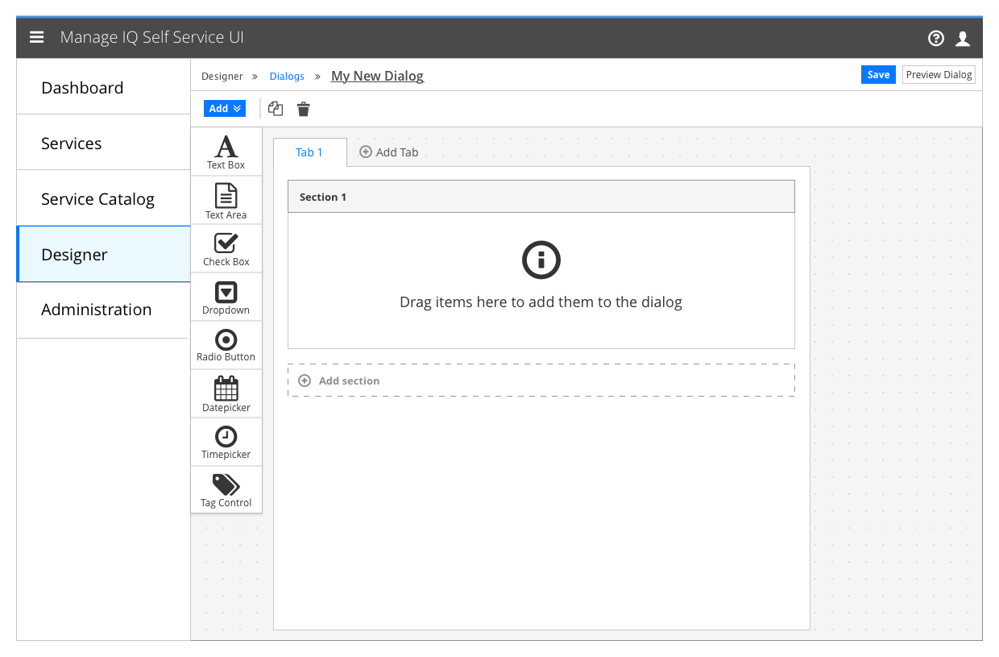
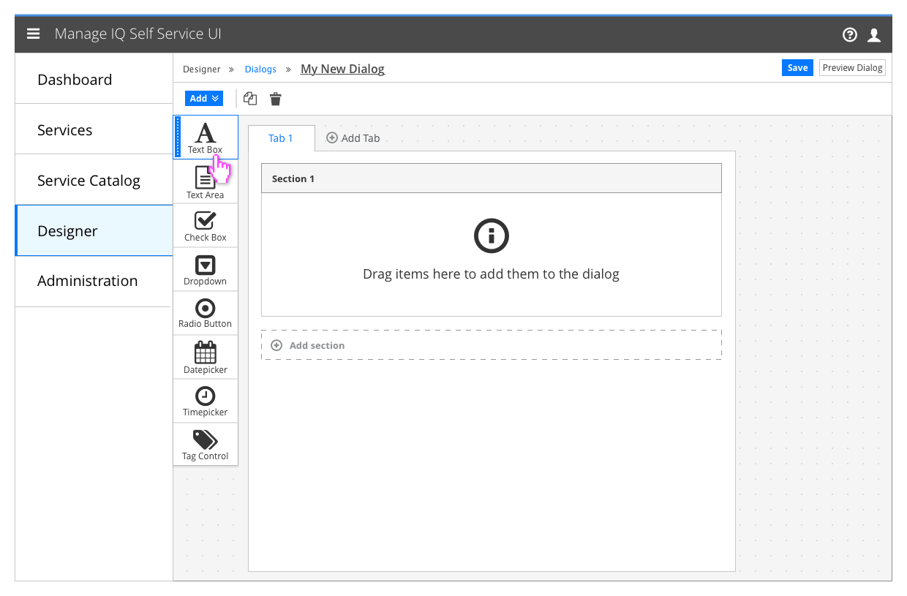
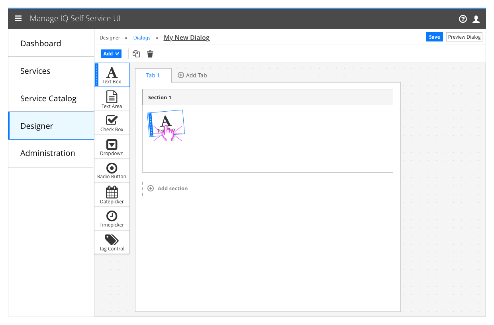
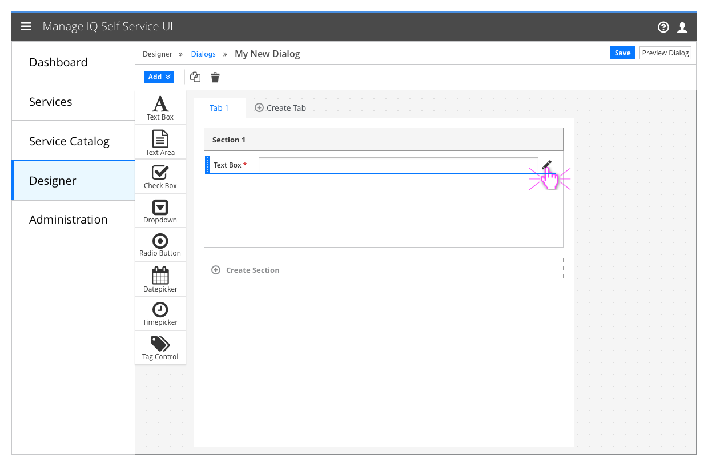
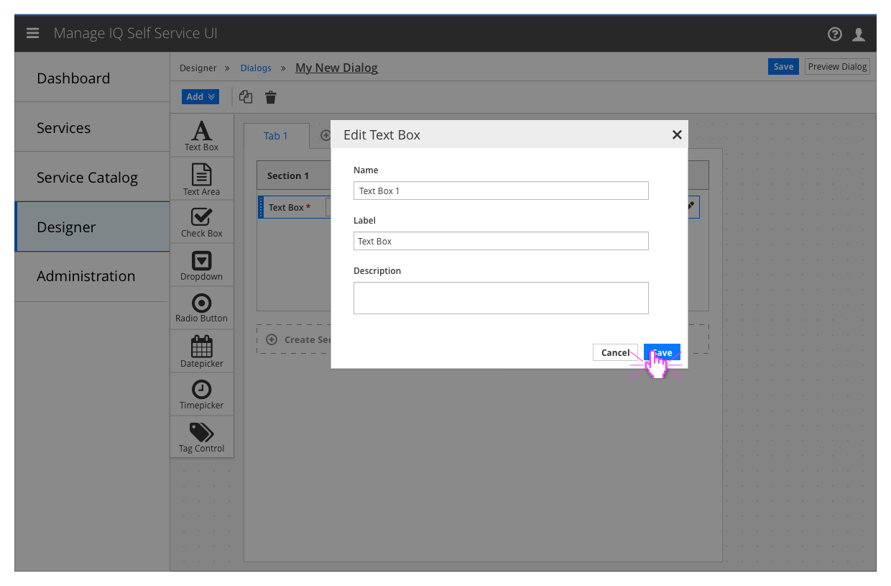
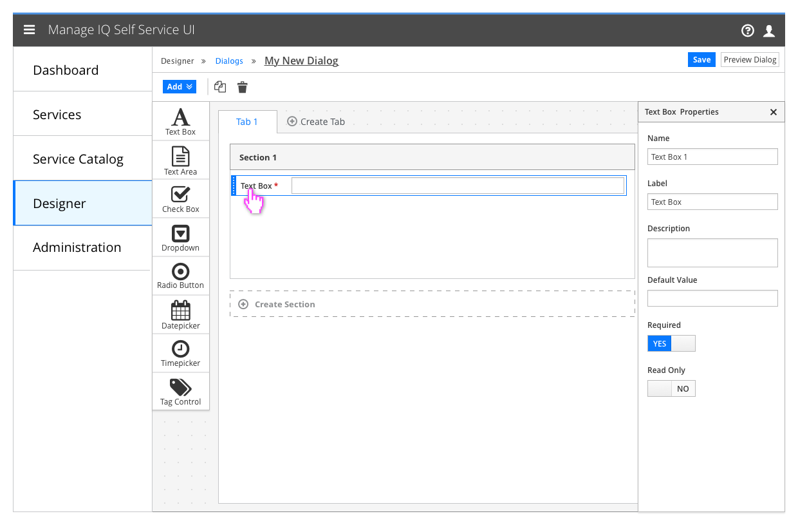
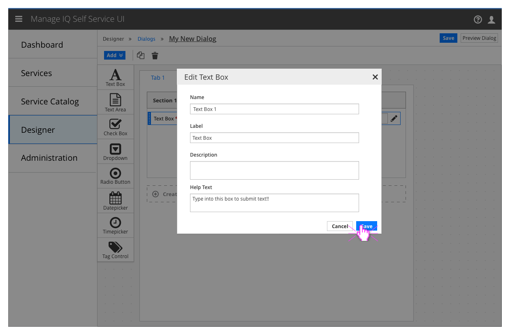
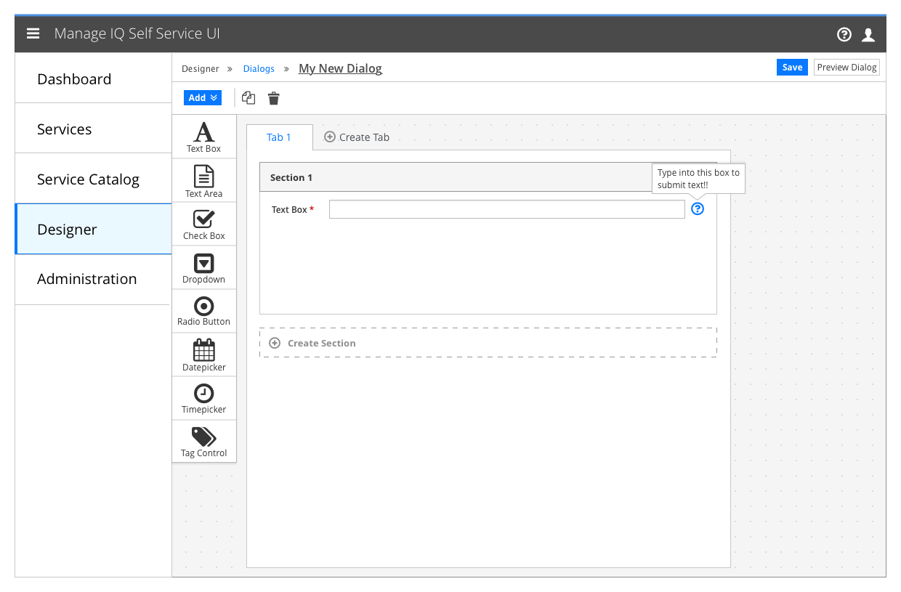
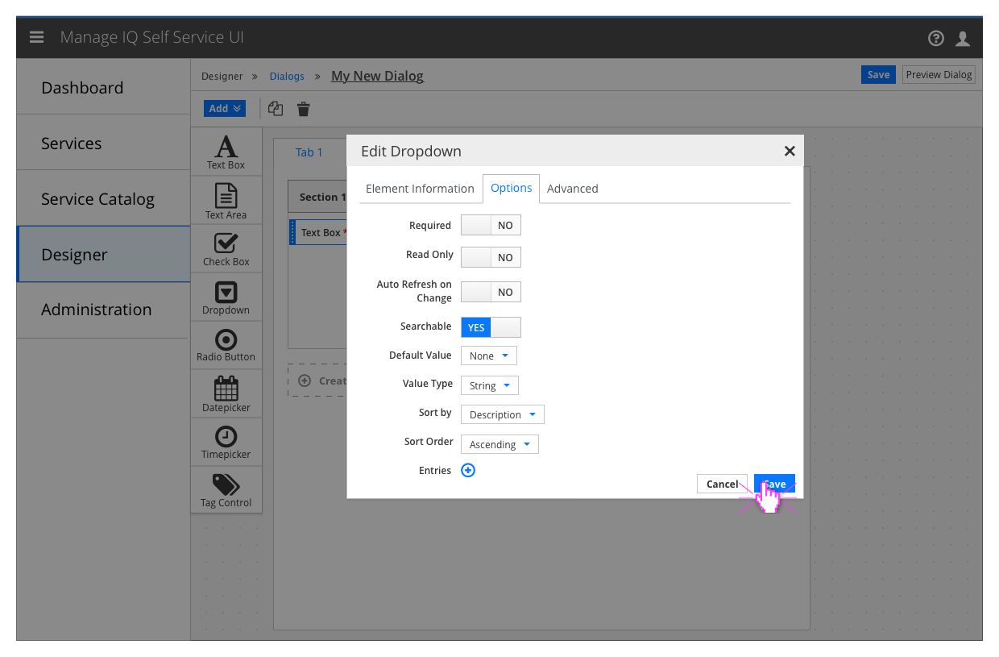

# Dialogs

- "Dialogs" is a secondary item under the "Designer" category
- This area is for the Service Designer and is not visible to other users
- This area is provided so the Designer can create and edit service dialogs

## Dialog Editor

### Blank Dialog Editor

- When the user creates a new dialog, they are brought to this screen with a single tab and section already populated.

#### Implementation Details
- The Dialog Editor should follow the same conventions as the blueprint editor when generating names for new dialogs and dialog elements. (e.g. "Untitled Dialog")

### Placing a dialog element

- Hovering over an element in the toolbar or on the canvas should show a grab handle and outline of the element

- The user may click and drag the element to a specific place, or click on it once which will place it at the end of the lowest section on the current tab

### Editing an element

- Elements can be duplicated and deleted by selecting them and clicking the duplicate and delete buttons in the toolbar.
- Hovering over a placed element will show the edit icon

- Clicking the edit icon should bring up the element editor modal

#### Implementation Details
  - The title of the modal should be "Edit [type of element]"

### Stretch Featues (Optional)

- Space and technology permitting, the element editor modal should be replaced with an element properties panel that enables the user to edit the selected element in real time.
- Undo and Redo features would be required for this to be effective
- Checking the "Preview Dialog" option would hide the toolbox and properties panel and display the dialog as it would appear when it is being used.

### Additional Functionality

- Filling in the Help Text field on an element will provide the consumer with information about the purpose of the element and how it should be populated.

- If an element has a populated Help Text field (not undefined) the rendered element in the dialog will be accompanied by a [Field Level Help](https://www.patternfly.org/pattern-library/forms-and-controls/field-level-help/#_) icon.
- Elements with undefined Help Text will not have this icon

- Dropdown elements will have an additional parameter that if turned on, will enable the [search capabilities](https://www.patternfly.org/pattern-library/widgets/#bootstrap-select) of the dropdown

## Customer Feedback

### Customer Feedback Received
  - Overview of customer feedback received

### Necessary Customer Feedback
  - Questions to follow up with customers
